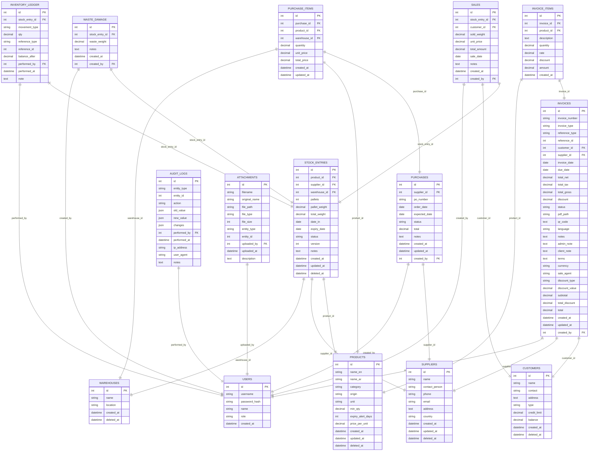

```mermaid
erDiagram
    USERS {
        int id PK
        string username
        string password_hash
        string name
        string role
        datetime created_at
    }
    
    WAREHOUSES {
        int id PK
        string name
        string location
        datetime created_at
        datetime deleted_at
    }
    
    SUPPLIERS {
        int id PK
        string name
        string contact_person
        string phone
        string email
        text address
        string country
        datetime created_at
        datetime updated_at
        datetime deleted_at
    }
    
    CUSTOMERS {
        int id PK
        string name
        string contact
        text address
        string type
        decimal credit_limit
        decimal balance
        datetime created_at
        datetime deleted_at
    }
    
    PRODUCTS {
        int id PK
        string name_en
        string name_ar
        string category
        string origin
        string unit
        decimal min_qty
        int expiry_alert_days
        decimal price_per_unit
        datetime created_at
        datetime updated_at
        datetime deleted_at
    }
    
    STOCK_ENTRIES {
        int id PK
        int product_id FK
        int supplier_id FK
        int warehouse_id FK
        int pallets
        decimal pallet_weight
        decimal total_weight
        date date_in
        date expiry_date
        string status
        int version
        text notes
        datetime created_at
        datetime updated_at
        datetime deleted_at
    }
    
    PURCHASES {
        int id PK
        int supplier_id FK
        string po_number
        date order_date
        date expected_date
        string status
        decimal total
        text notes
        datetime created_at
        datetime updated_at
        int created_by FK
    }
    
    PURCHASE_ITEMS {
        int id PK
        int purchase_id FK
        int product_id FK
        int warehouse_id FK
        decimal quantity
        decimal unit_price
        decimal total_price
        datetime created_at
        datetime updated_at
    }
    
    INVOICES {
        int id PK
        string invoice_number
        string invoice_type
        string reference_type
        int reference_id
        int customer_id FK
        int supplier_id FK
        date invoice_date
        date due_date
        decimal total_net
        decimal total_tax
        decimal total_gross
        decimal discount
        string status
        string pdf_path
        text qr_code
        string language
        text notes
        text admin_note
        text client_note
        text terms
        string currency
        string sale_agent
        string discount_type
        decimal discount_value
        decimal subtotal
        decimal total_discount
        decimal total
        datetime created_at
        datetime updated_at
        int created_by FK
    }
    
    INVOICE_ITEMS {
        int id PK
        int invoice_id FK
        int product_id FK
        text description
        decimal quantity
        decimal rate
        decimal discount
        decimal amount
        datetime created_at
    }
    
    SALES {
        int id PK
        int stock_entry_id FK
        int customer_id FK
        decimal sold_weight
        decimal unit_price
        decimal total_amount
        date sale_date
        text notes
        datetime created_at
        int created_by FK
    }
    
    WASTE_DAMAGE {
        int id PK
        int stock_entry_id FK
        decimal waste_weight
        text notes
        datetime created_at
        int created_by FK
    }
    
    INVENTORY_LEDGER {
        int id PK
        int stock_entry_id FK
        string movement_type
        decimal qty
        string reference_type
        int reference_id
        decimal balance_after
        int performed_by FK
        datetime performed_at
        text note
    }
    
    AUDIT_LOGS {
        int id PK
        string entity_type
        int entity_id
        string action
        json old_value
        json new_value
        json changes
        int performed_by FK
        datetime performed_at
        string ip_address
        string user_agent
        text notes
    }
    
    ATTACHMENTS {
        int id PK
        string filename
        string original_name
        string file_path
        string file_type
        int file_size
        string entity_type
        int entity_id
        int uploaded_by FK
        datetime uploaded_at
        text description
    }
    
    %% Relationships
    STOCK_ENTRIES ||--|| PRODUCTS : "product_id"
    STOCK_ENTRIES ||--|| SUPPLIERS : "supplier_id"
    STOCK_ENTRIES ||--|| WAREHOUSES : "warehouse_id"
    
    PURCHASES ||--|| SUPPLIERS : "supplier_id"
    PURCHASES ||--|| USERS : "created_by"
    PURCHASE_ITEMS ||--|| PURCHASES : "purchase_id"
    PURCHASE_ITEMS ||--|| PRODUCTS : "product_id"
    PURCHASE_ITEMS ||--|| WAREHOUSES : "warehouse_id"
    
    INVOICES ||--|| CUSTOMERS : "customer_id"
    INVOICES ||--|| SUPPLIERS : "supplier_id"
    INVOICES ||--|| USERS : "created_by"
    INVOICE_ITEMS ||--|| INVOICES : "invoice_id"
    INVOICE_ITEMS ||--|| PRODUCTS : "product_id"
    
    SALES ||--|| STOCK_ENTRIES : "stock_entry_id"
    SALES ||--|| CUSTOMERS : "customer_id"
    SALES ||--|| USERS : "created_by"
    
    WASTE_DAMAGE ||--|| STOCK_ENTRIES : "stock_entry_id"
    WASTE_DAMAGE ||--|| USERS : "created_by"
    
    INVENTORY_LEDGER ||--|| STOCK_ENTRIES : "stock_entry_id"
    INVENTORY_LEDGER ||--|| USERS : "performed_by"
    
    AUDIT_LOGS ||--|| USERS : "performed_by"
    
    ATTACHMENTS ||--|| USERS : "uploaded_by"
```